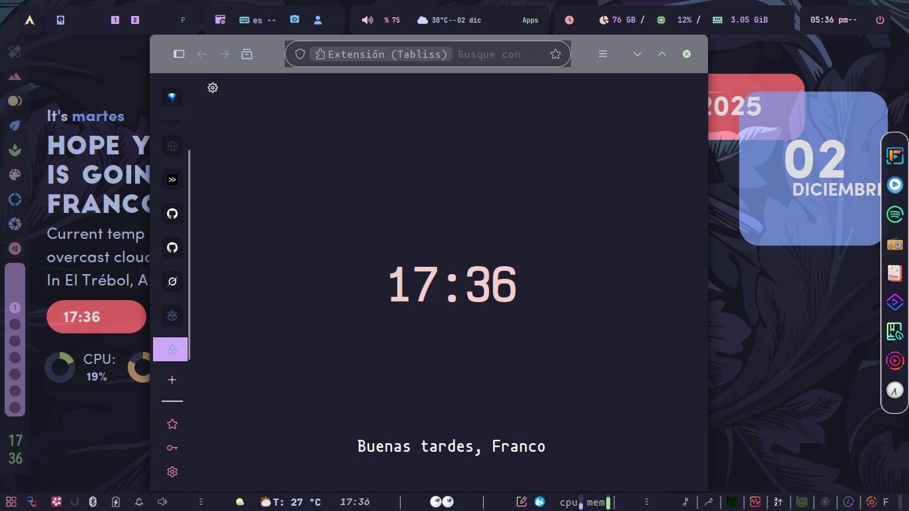
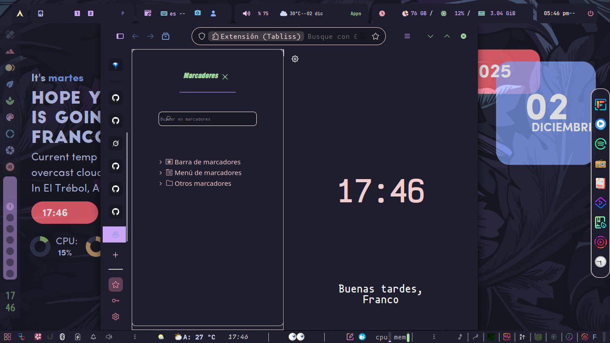

🦊 Firefox Catppuccin-Inspired Theme (userChrome.css)

Un tema personalizado para el navegador Mozilla Firefox, diseñado para entornos de desarrollo. Utiliza una paleta de colores oscura y de bajo contraste, inspirada en el esquema de colores de Catppuccin (Latte, Frappé, Macchiato, Mocha, etc.), enfocado en la armonía visual y la reducción de la fatiga visual.

✨ Paleta de Colores Principal

Este tema se basa en una paleta de colores distintiva para sus elementos clave:

Elemento

Color Hex

Propósito

Fondo Base

#1e1e2e

Barra de Navegación, Sidebar, Fondos de la Ventana.

Fondo Secundario

#181825

Pestañas no seleccionadas, Input de URL.

Accento Principal

#cba6f7

Pestaña Activa, Elementos Interactivos (botones genéricos).

Accento Secundario

#89b4fa

Botones de Navegación (Atrás/Adelante).

Texto/Contraste

#f5e0dc

Texto General.

Éxito (Verde)

#a6e3a1

Encabezados/Títulos.

📸 Vistas Previas

Vista General de la Ventana

Aquí se muestra el aspecto de la ventana principal de Firefox con el tema aplicado.

Barra Lateral (Sidebar)

Vista detallada de la barra lateral (Historial, Marcadores) con el esquema de colores aplicado.

Barra de Navegación y Pestañas

Detalle de la barra de URL y cómo lucen las pestañas activas y no activas.

⚙️ Instalación

Abre tu carpeta de perfil de Firefox.

Crea una carpeta llamada chrome (si no existe).

Copia y pega el archivo userChrome.css dentro de la carpeta chrome.

Reinicia Firefox.

Nota: El uso de userChrome.css requiere que la opción toolkit.legacyUserProfileCustomizations.enabled esté configurada como true en about:config de Firefox.
